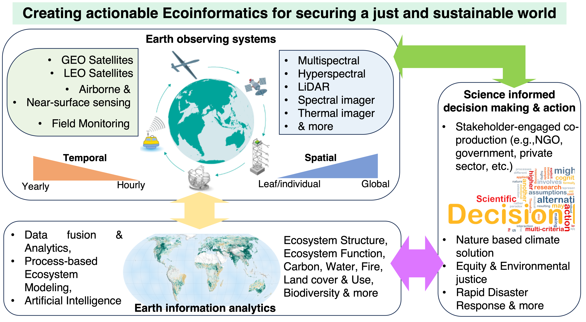

# My research vision is ‘Creating actionable environmental and ecological information to make our society and ecosystem more just and sustainable’. To achieve this goal, my research uses multi-platform remote-sensing, in situ measurements, and process-based models to understand processes impacting ecosystems and works closely with end-users to make effective and impactful plans and actions. 

## Climate-vegeation-human interaction

## Remote sensing of vegetation structure and carbon dynamics

## Climate change impact assessment

