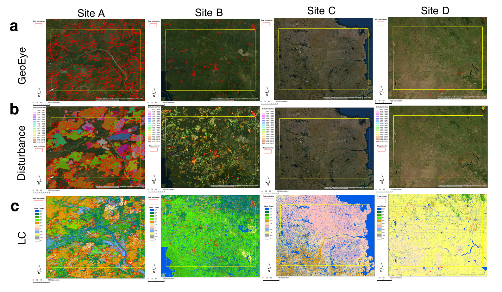

## Research Vision

My research vision is ‘Creating actionable environmental and ecological information to make our society and ecosystem more just and sustainable’. To achieve this goal, my research uses multi-platform remote-sensing, in situ measurements, and process-based models to understand processes impacting ecosystems and works closely with end-users to make effective and impactful plans and actions (see below schematic diagram). 

 
 
 

## Research Focus 1: Climate-vegeation-human interaction
  ### * Current projects
  
   
  
  [2024 to 2027 - CNRA & CARB] Wildfire, Ecosystem Resilience & Climate Monitoring & Assessment Initiative (WERC) (Project Scientist: Taejin Park)
  

 
 
 

## Research Focus 2: Remote sensing of vegetation structure and carbon dynamics
  ### * Current projects 
  
   
  
  [2023 to 2026 - NASA] Flux Towers on Geostationary Orbits: Resolving Diurnal Cycles of Terrestrial Vegetation Processes with Hypertemporal Geostationary Data Streams (PI: Weile Wang, Participated as Co-I)
  
  [2022 to 2025 - NASA] Carbon monitoring system across Mexico: continued development and application at the national scale (NASA CMS, PI: Rodrigo Vargas, Participated as Co-I)

  [2021 to 2024 - NASA] Monitoring and forecasting large-scale patterns of forest structure and carbon dynamics using field, remote sensing, and process-based models (NASA GEDIST, PI: Taejin Park)

  
  

 
 
 

## Research Focus 3: Climate change impact assessment
  ### * Current projects 
  
   
  
  [2023 to 2028 - NASA] NEX-Core National Climate Assessment Support Activity (PI: Ian. G. Brosnan, Participated as Researcher)
  
  

